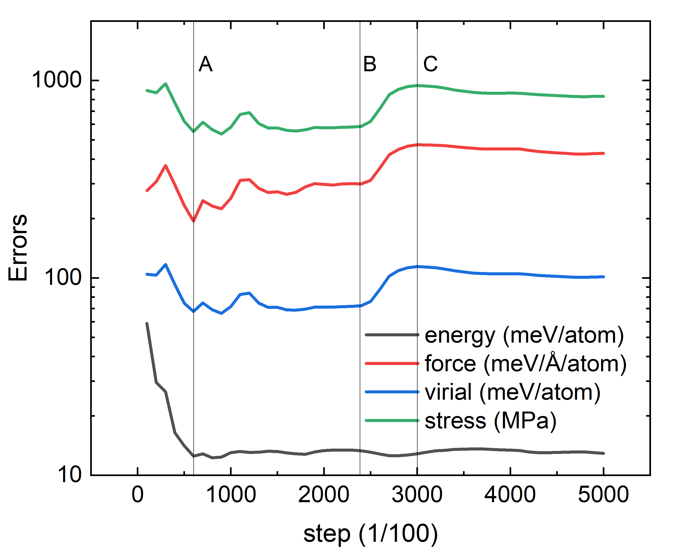
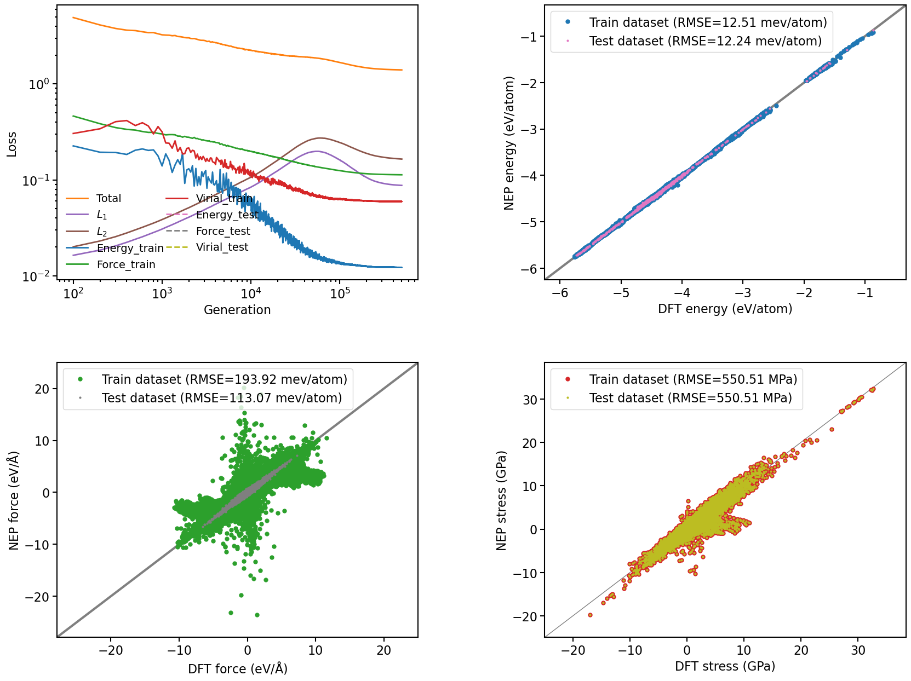
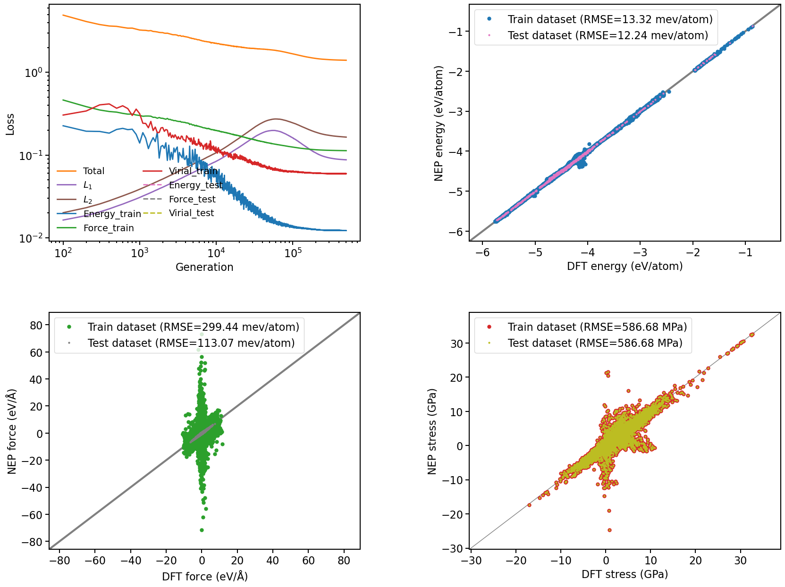
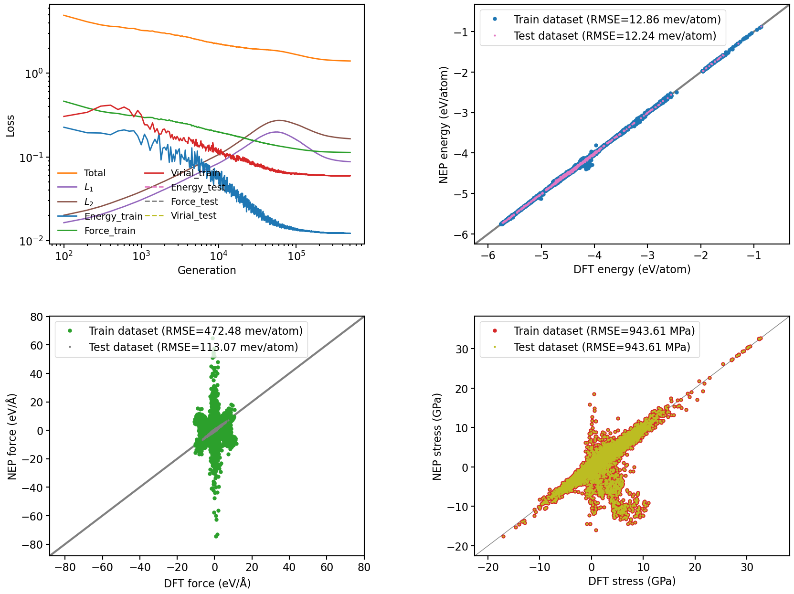

# 测试NEP的参数

使用OpenLAM训练集来测试NEP的性能。

这部分的训练集为975帧由第一代NEP训练获得的势函数，通过PyNEP挑选出来的。其中距离设置为0.05。测试集部分为整个的训练集，包含54771帧。

## 结果

下图为运行步数与误差之间的关系，这里使用的势函数为使用训练集获得。图中标记了A、B、C三处分别对应6W、24W和30W步时的误差数据分布情况供参考。









## 分析

### 假设1：过拟合

NEP基于强大的演化算法可以使得每个参数发挥最大效力。

并且由于之前的测试中使用小的neuron仍然可以对“大模型”获得好的预测性得出，机器学习力场本身不需要复杂的神经网络以及参数进行描述（可以参考经验力场）。

因此，在部分训练集的过程中，由于参数个数的充足性，使得模型很快具备一定的预测能力。然而继续训练后，参数发生过拟合，因此对于整体的模型预测性。

### 假设2：训练集不完善

在机器学习势的拟合过程中，训练集需要足够充足才能很好的对势能面进行预测。

对于PyNEP挑选出来的结构，不足以很好的描述整个势能面，因此在持续训练的过程中丢失了真实势能面的情况。

### 假设3：训练集有分歧

这点主要由力的对角线图的形状变化获得，有待进一步分析。

## 测试方法

- nep.in

```
type       15 Li B O Al Si P S Cl Ga Ge As Br Sn Sb I
version    4
cutoff     7 5
n_max      6 4
basis_size 8 8
l_max      4 2 1
neuron     30
#lambda_1  0
#lambda_2  0.2
lambda_e   1
lambda_f   10
lambda_v   0.1
batch      2000
population 60
generation 10000
```

- run.sh

```
#!/bin/bash
set -e
set -u

for i in $(seq 50) ; do
    nep > out.$i
    cp nep.txt nep.$i.txt
done
```
