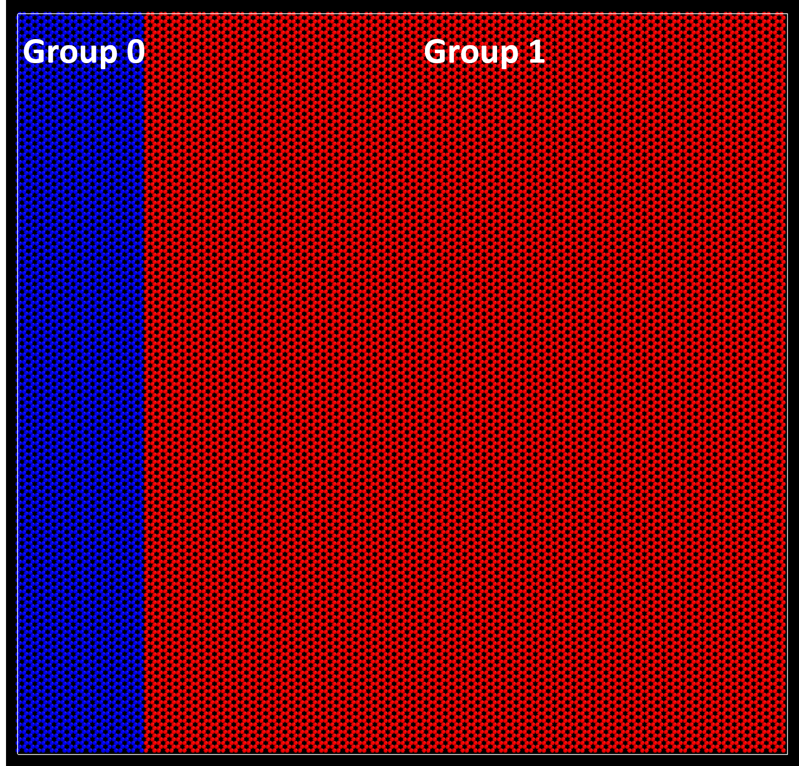
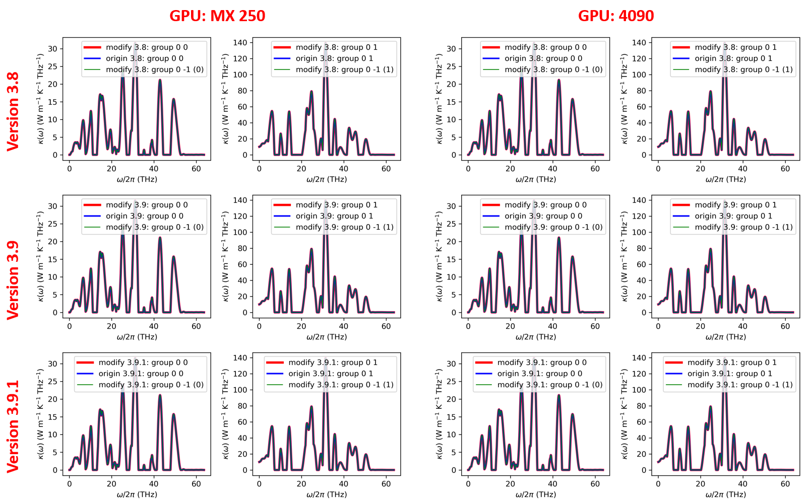

# Modify compute_shc
Make the compute_shc command in GPUMD support multiple sets of calculations

Date: 2021-11-27

## Refer to [compute_dos](https://gpumd.org/gpumd/input_parameters/compute_dos.html) command
* compute_shc <sample_interval> <Nc> <transport_direction> <num_omega> <max_omega> [{<optional_arg>}]

<optional_arg> can only be group, which requires two parameters:

* group <grouping_method> <group_id>

If group is -1, it means to calculate the SHC for every group in the group_method.
If each atom is in one group, one can get the per-atom SHC.

## Instructions
* copy script/modify_shc.cu to ${GPUMD}/src/measure/shc.cu
* copy script/modify_shc.cuh to ${GPUMD}/src/measure/shc.cuh
* add the -DDEBUG in src/makefile (-DUSE_TABLE)
* cd ${GPUMD}/src && make clean && make gpumd -j12

## Test

### Input
* [model.xyz](https://github.com/brucefan1983/GPUMD/blob/master/examples/04_Carbon_thermal_transport_nemd_and_hnemd/diffusive/model.xyz)
> 24000

> pbc="T T F" Lattice="245.951 0 0 0 255.6 0 0 0 3.35" Properties=species:S:1:pos:R:3:group:I:1

* run.in

| Command       | Parameters                        |
| ------------- | --------------------------------- |
| potential     | Graphene_Lindsay_2010_modified.txt
| velocity      | 300
| ensemble      | nvt_nhc 300 300 100
| time_step     | 1
| dump_thermo   | 1000
| run           | 1000
| ensemble      | nvt_nhc 300 300 100
| compute_hnemd | 1000 0 0.00001 0
| compute_shc   | 2 250 1 1000 400.0 group 0 Ngroup
| run           | 3000

### Results

